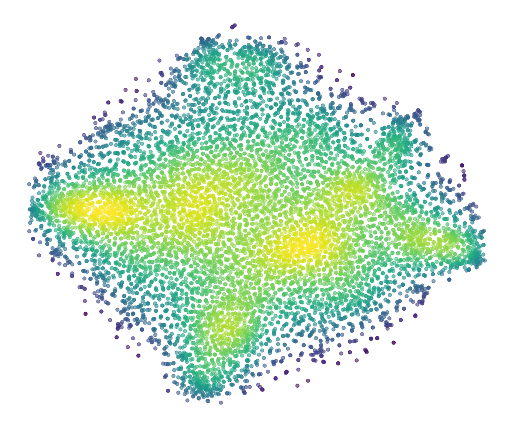
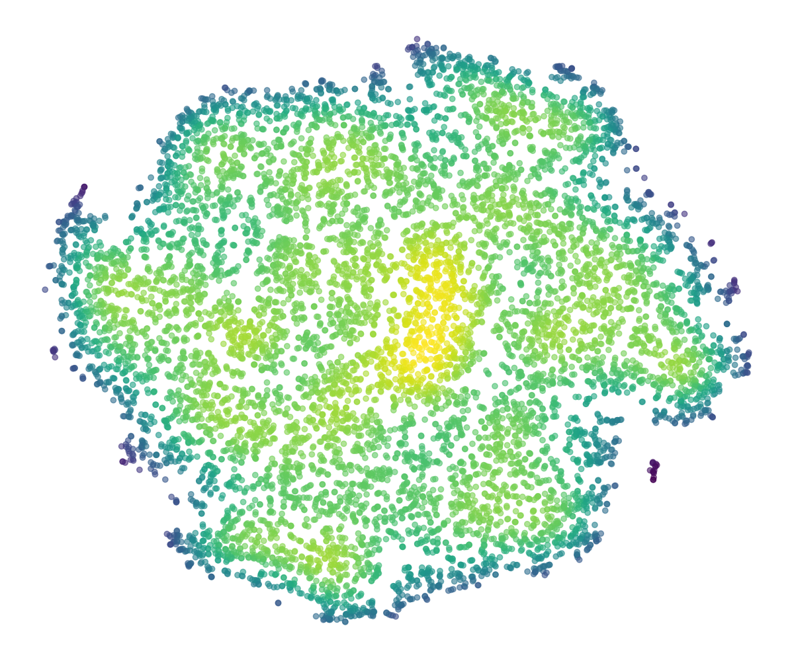

# Visualize Your Latent Atlas

Explore VAE latent spaces with t-SNE visualization. Extract latents from any images using registered VAE models, then visualize the latent distribution.

[](https://huggingface.co/spaces)

<p align="center">
  
  
</p>
<p align="center">
  <sub><b>Left:</b> LDM f16d32 · <b>Right:</b> VA-VAE f16d32 (DINOv2) — from <a href="https://github.com/hustvl/LightningDiT">LightningDiT</a></sub>
</p>

## Features

- **Flexible VAE registry**: Add any diffusers-based VAE via `config.yaml` (HuggingFace Hub or local path)
- **Dataset registry**: ImageFolder-style datasets with config-driven paths
- **t-SNE visualization**: Density-colored scatter plots with uniformity metrics
- **Gradio WebUI**: Local and Hugging Face Spaces deployment
- **CLI scripts**: `extract_features.py` and `visualize.py`

## Quick Start

### Install

```bash
pip install -e .
# or
pip install -r requirements.txt
```

### Config

The app uses `config.example.yaml` by default. Copy to `config.yaml` to customize:

```bash
cp config.example.yaml config.yaml
```

Edit to add your VAEs and datasets. Example:

```yaml
vaes:
  SD21-VAE:
    pretrained_path: stabilityai/sd-vae-ft-mse
    scaling_factor: 0.18215
    latent_channels: 4
    spatial_compression: 8

datasets:
  my_images:
    root: ./data/images
    image_size: 256
```

See [docs/REGISTRY.md](docs/REGISTRY.md) for the full registry format.

### Extract Latents

```bash
python scripts/extract_features.py \
  --vae SD21-VAE \
  --data /path/to/image/folder \
  --output outputs/latents
```

### Visualize

```bash
python scripts/visualize.py \
  --latent-dir outputs/latents \
  --output tsne.png
```

### Web UI

**Local:**

```bash
python app.py
# or
python scripts/run_app.py --port 7860 --share
```

**Hugging Face Spaces:**

Add `app.py` as the main app. The repo includes:

- `app.py` — Spaces entry point (auto-detects `SPACE_ID`)
- `requirements.txt` — Dependencies

Create a Space, set SDK to Gradio, and point to `app.py`.

## Project Structure

```
visualize-your-latent-atlas/
├── config.example.yaml  # Default config (copy to config.yaml to customize)
├── app.py               # HF Spaces / local Gradio entry
├── requirements.txt
├── pyproject.toml
├── latent_atlas/        # Main package
│   ├── config.py        # Config loader
│   ├── registry/        # list_vaes, list_datasets
│   ├── models/          # VAE loader (diffusers)
│   ├── datasets/        # ImageFolder loader
│   ├── core/            # extract, visualize
│   └── web/             # Gradio app
├── scripts/             # CLI
│   ├── extract_features.py
│   ├── visualize.py
│   └── run_app.py
└── docs/
    └── REGISTRY.md      # Registry format spec
```

## Registry Format

Inspired by [VAEs4RS](https://github.com/your-org/VAEs4RS): models and datasets are registered in YAML. No decorators—just add entries to `config.yaml`.

### VAE Entry

```yaml
vaes:
  My-VAE:
    pretrained_path: org/model-id   # or /local/path
    subfolder: vae                  # optional
    scaling_factor: 0.18215
    latent_channels: 4
    spatial_compression: 8
```

`_class_name` in the model's `config.json` selects the architecture (AutoencoderKL, AutoencoderKLFlux2, etc.).

### Dataset Entry

```yaml
datasets:
  my_dataset:
    root: /path/to/images
    image_size: 256
    num_classes: null
    split_file: null  # optional
```


## License

GPL-3.0
